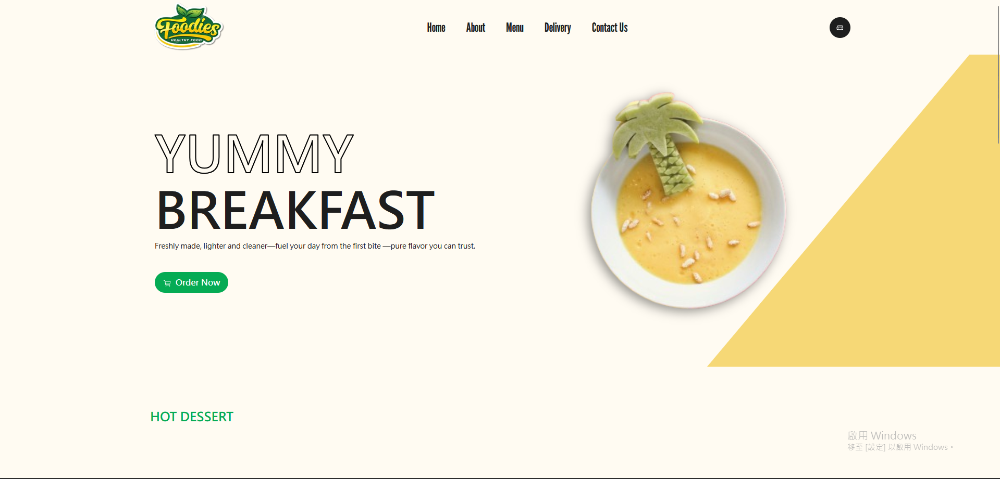
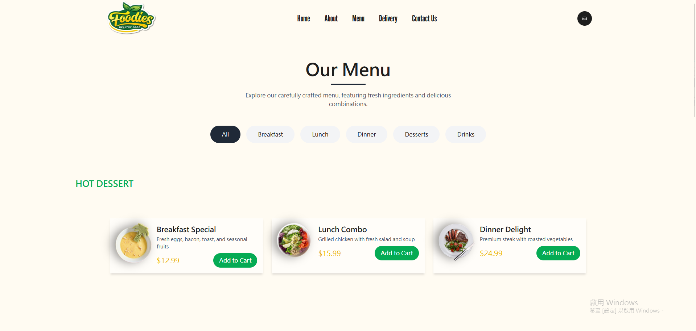
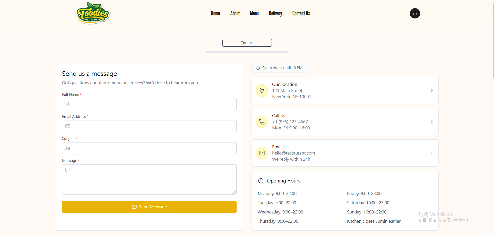

# Foodie's Restaurant Website 🍽️

A modern, responsive restaurant website built with React, Tailwind CSS, and Framer Motion.


## ✨ Features

### 🏠 Homepage

- Hero section with animated text and background
- Featured dishes carousel
- Latest menu additions
- Customer testimonials

### 🍽️ Menu

- Interactive menu categories
- Dish cards with hover effects
- Quick view options
- Filtering and sorting capabilities

### 🚚 Delivery

- Real-time order tracking
- Service area map
- Delivery status updates
- Service features showcase

### 📞 Contact

- Interactive contact form
- Google Maps integration
- Business hours display
- FAQ accordion

## 🛠️ Technologies Used

- **React 18** - UI Framework
  - Functional components with hooks
  - Context for state management
  - Custom hooks for reusability

- **Tailwind CSS 3** - Styling
  - Utility-first approach
  - Custom theme configuration
  - Responsive design utilities

- **Framer Motion 10** - Animations
  - Page transitions
  - Scroll animations
  - Gesture interactions
  - Variants system

- **React Router 6** - Navigation
  - Route configuration
  - Dynamic routing
  - Protected routes
  - Navigation guards

- **Vite 4** - Build Tool
  - Fast HMR (Hot Module Replacement)
  - Optimized build process
  - Environment variables support
  
- **Additional Tools**
  - ESLint - Code quality
  - PostCSS - CSS processing
  - Firebase - Hosting & deployment
  - React Icons - Icon library

## 📁 Project Structure

```plaintext
food-website/
├── public/                 # Static files
│   └── food/              # Food images
│
├── screenshots/           # Project screenshots for documentation
│   ├── features/         # Feature-specific screenshots
│   └── mobile/          # Mobile view screenshots
│
├── src/                  # Source code
│   ├── assets/          # Project assets
│   │   └── food/        # Food images used in components
│   │
│   ├── components/      # Reusable components
│   │   ├── Banner/      # Site banner component
│   │   ├── Footer/      # Site footer
│   │   ├── Hero/        # Hero section
│   │   ├── LatestDessert/   # Latest desserts section
│   │   ├── Navbar/      # Navigation bar
│   │   ├── PopularRecipe/   # Popular recipes section
│   │   └── Testimonial/     # Customer testimonials
│   │
│   ├── pages/           # Page components
│   │   ├── About.jsx    # About page
│   │   ├── Contact.jsx  # Contact page
│   │   ├── Delivery.jsx # Delivery information
│   │   ├── Home.jsx     # Homepage
│   │   └── Menu.jsx     # Menu page
│   │
│   |── App.jsx          # Main app component
│   ├── index.css        # Global styles
│   └── main.jsx         # App entry point
│
├── .eslintrc.cjs        # ESLint configuration
├── firebase.json        # Firebase configuration
├── index.html          # HTML entry point
├── package.json        # Project dependencies and scripts
├── postcss.config.js   # PostCSS configuration
├── tailwind.config.js  # Tailwind CSS configuration
└── vite.config.js      # Vite configuration
```

### 📂 Key Directories

#### `/src/components`
Core UI components organized by functionality:
- `Navbar/`: Site navigation with responsive menu
- `Hero/`: Landing page hero section with animations
- `Banner/`: Reusable banner component
- `Footer/`: Site footer with navigation and contact info
- `LatestDessert/`: Latest menu additions showcase
- `PopularRecipe/`: Featured recipes section
- `Testimonial/`: Customer reviews section

#### `/src/pages`
Page-level components:
- `Home.jsx`: Landing page with featured sections
- `Menu.jsx`: Interactive menu with categories
- `Contact.jsx`: Contact form and information
- `Delivery.jsx`: Delivery tracking and services
- `About.jsx`: About us page

#### `/src/assets`
Static assets used in the application:
- `food/`: Food images optimized for web
- Other assets like icons and backgrounds

### 🛠️ Configuration Files

#### Core Configuration
- `vite.config.js`: Vite bundler settings and plugins
- `tailwind.config.js`: Tailwind CSS theme customization
- `postcss.config.js`: PostCSS plugins setup
- `eslint.config.js`: ESLint rules and settings

#### Firebase Configuration
- `firebase.json`: Firebase hosting and deployment settings

### 🏃‍♂️ Getting Started

1. Clone the repository
```bash
git clone https://github.com/your-username/food-website.git
cd food-website
```

2. Install dependencies
```bash
npm install
```

3. Start development server
```bash
npm run dev
```

4. Build for production
```bash
npm run build
```

### 📝 Development Guidelines

- Use component-based folder structure (`ComponentName/ComponentName.jsx`)
- Keep styles in corresponding component folders
- Follow established naming conventions
- Implement animations with Framer Motion
- Utilize Tailwind CSS utility classes
- Maintain responsive design principles
- Write semantic HTML for accessibility
- Optimize images before adding to assets

### 🔄 Component Update Process

When adding new components:
1. Create a new folder in `/src/components`
2. Include component and associated styles
3. Export from `index.js` if needed
4. Import in relevant pages
5. Update routing configuration if necessary
6. Test responsive behavior
7. Add documentation comments

### 🌍 Environment Setup

#### Prerequisites
- Node.js >= 16.0.0
- npm >= 8.0.0
- Git

#### Development Environment
```bash
# Install Node.js dependencies
npm install

# Start development server
npm run dev

# Run linting
npm run lint

# Run build
npm run build
```

### ⚙️ Advanced Configuration

#### Tailwind Configuration
```js
// tailwind.config.js
module.exports = {
  content: ['./src/**/*.{js,jsx}'],
  theme: {
    extend: {
      colors: {
        // Custom color palette
      },
      fontFamily: {
        // Custom fonts
      }
    }
  },
  plugins: [
    // Additional plugins
  ]
}
```

#### Vite Configuration
```js
// vite.config.js
export default {
  plugins: [react()],
  server: {
    port: 3000,
    open: true
  },
  build: {
    outDir: 'dist',
    sourcemap: true
  }
}
```

### 📦 Production Build

```bash
# Create production build
npm run build

# Preview production build locally
npm run preview

# Deploy to Firebase
npm run deploy
```

### 🔍 Testing

```bash
# Run unit tests
npm run test

# Run e2e tests
npm run test:e2e

# Run test coverage
npm run test:coverage
```

### 📚 Additional Resources

- [React Documentation](https://react.dev)
- [Tailwind CSS Documentation](https://tailwindcss.com/docs)
- [Framer Motion API](https://www.framer.com/motion)
- [Vite Guide](https://vitejs.dev/guide)
- [Firebase Hosting](https://firebase.google.com/docs/hosting)
